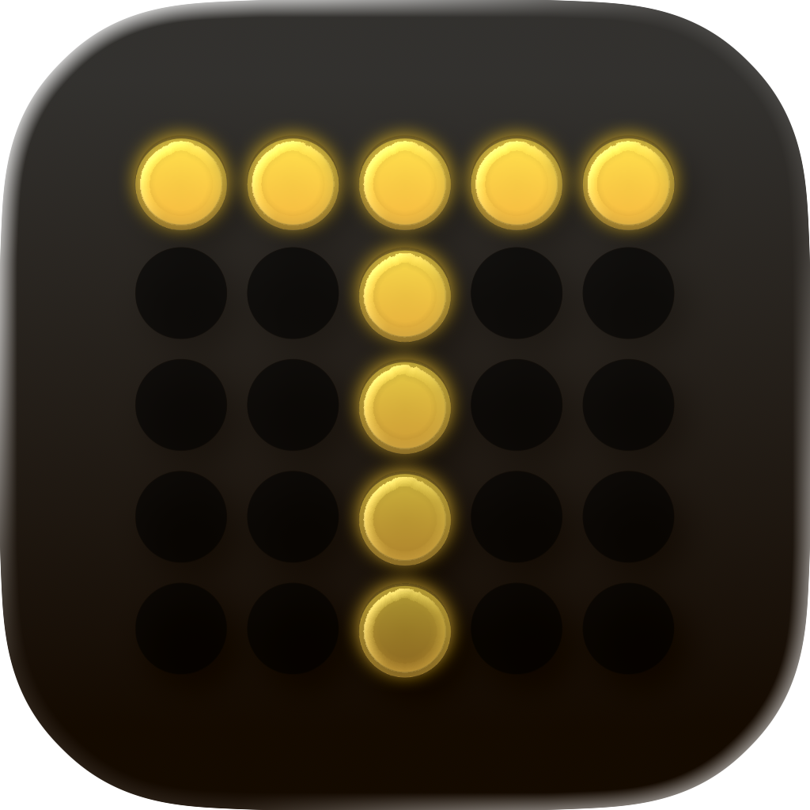
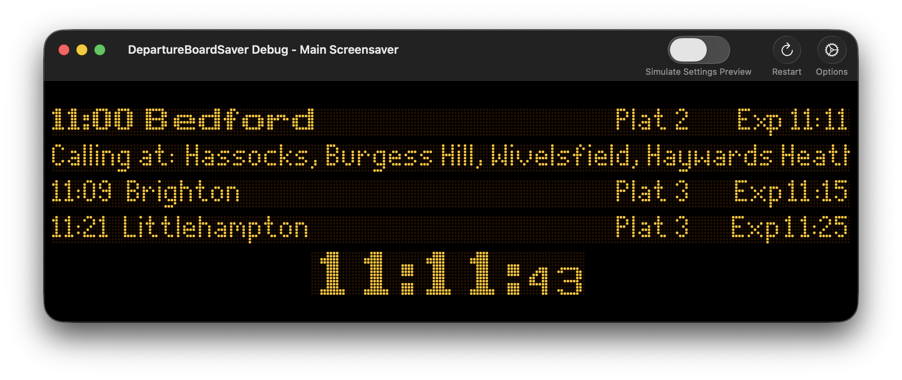

<h1 align="left">
  
  DepartureBoardSaver
</h1>

Built by [Justyn Henman](https://justynhenman.com).


[](https://github.com/ju5tyn/DepartureBoardSaver/releases/latest)

[](https://ko-fi.com/justynhenman)

This project is a macOS screen saver that displays a real-time UK train departure board! It is modelled on the classic dot-matrix boards found at British railway stations. Inspired and derived from [chrisys/train-departure-display](https://github.com/chrisys/train-departure-display).

Departure data is fetched live from the [Rail Delivery Group](https://raildata.org.uk) Live Departure Board API every 60 seconds.

<p align="center">
  
</p>

## Display styles

| Style | Description |
|-------|-------------|
| **Dot Matrix** (default) | Each pixel rendered as a physical amber LED dot with glow, powered by Metal for GPU acceleration |
| **OLED** | Amber on black, teletext style [NO GPU ACCELERATION] |
| **LCD** | White text on dark navy [NO GPU ACCELERATION] |

## Installation

Download the latest release from the [Releases page](https://github.com/ju5tyn/DepartureBoardSaver/releases/latest) and unzip it. Double-click `DepartureBoardSaver.saver` and macOS will prompt you to install it.

Alternatively, copy it manually:

```sh
# current user only
cp -R DepartureBoardSaver.saver ~/Library/Screen\ Savers/

# all users (requires admin)
sudo cp -R DepartureBoardSaver.saver /Library/Screen\ Savers/
```

Then open **System Settings → Wallpaper**, click **Screen Saver**, scroll to the bottom to 'other', select **DepartureBoardSaver**, and click **Options** to enter your station CRS code (e.g. `PAD` for London Paddington).

No API key is required — live departure data is provided out of the box via a shared service. Optionally, register for your own free key at [raildata.org.uk](https://raildata.org.uk) for dedicated access.

## Building from Source

**Requirements:** macOS 14 Sonoma or later, Xcode 16 or later.

1. Clone the repository:
   ```sh
   git clone https://github.com/ju5tyn/DepartureBoardSaver.git
   cd DepartureBoardSaver
   ```

2. Open the project in Xcode:
   ```sh
   open DepartureBoardSaver.xcodeproj
   ```

3. Select the **DepartureBoardSaver** scheme and build (`⌘B`). The compiled `.saver` bundle lands in `Products/DepartureBoardSaver.saver`.

   A **DepartureBoardSaverTestHost** scheme is also included — a lightweight macOS app that hosts the screen saver view directly, making it easy to iterate without installing the `.saver` bundle each time.

> **Note:** The Release configuration requires a **Developer ID Application** certificate for notarized distribution. For local development, use the Debug configuration (the default in Xcode). To build Release without a Developer ID, open the target's Signing & Capabilities tab, switch Code Signing Style to **Automatic**, and select your personal team.

## Configuration

| Setting | Description |
|---------|-------------|
| API Key | Optional — leave blank to use the built-in shared service, or paste a free key from [raildata.org.uk](https://raildata.org.uk) for dedicated access |
| Station | Three-letter CRS code (e.g. `PAD`, `WAT`, `MAN`) |
| Display style | Dot Matrix / OLED / LCD |
| Side padding | Percentage of screen width to leave on each side (0–30%) |
| Show station in clock | Toggle the station name in the clock panel |
| Metal rendering | GPU-accelerated dot-matrix mode (enabled by default) |

Settings are stored in `~/Library/Preferences/justynhenman.DepartureBoardSaver.plist`.

## Architecture

| File | Role |
|------|------|
| `DepartureBoardSaverView.swift` | `ScreenSaverView` subclass — animation loop, Metal layer management, drawing dispatch |
| `DepartureBoard.swift` | Layout engine — positions rows, scrolling text, clock |
| `DepartureService.swift` | Async REST/JSON client for the raildata.org.uk departure board API |
| `DepartureBoardConfig.swift` | Persistent settings via `ScreenSaverDefaults` |
| `DotMatrixMetalRenderer.swift` | GPU renderer — dot glow and grid via Metal |
| `DotMatrixShaders.metal` | Metal shader source |
| `ConfigureSheetController.swift` | Options sheet presented by Screen Saver preferences |
| `cloudflare-worker/` | Cloudflare Worker proxy — serves live data for users without a personal API key |
| `BoardFonts.swift` | Dot Matrix font registration helpers |

## Running your own Cloudflare Worker

The shared service is geo-restricted to the UK and runs on a single API key. If you'd prefer full control with your own quota, key, worker, and for whatever reason don't want to enter your API key into the screensaver settings, you can self-host using the files in `cloudflare-worker/`.

**Requirements:** a free [Cloudflare account](https://cloudflare.com) and [Node.js](https://nodejs.org).

> **Custom domain:** `wrangler.jsonc` is pre-configured to deploy to a custom subdomain (`departure-board-api.your-domain.com`). This requires your domain to be active on Cloudflare (i.e. its nameservers pointing to Cloudflare). If you'd rather use the default `*.workers.dev` subdomain, remove the `routes` block from `wrangler.jsonc`.

1. Register for a free API key at [raildata.org.uk](https://raildata.org.uk).

2. Update `wrangler.jsonc` with your own domain:
   ```jsonc
   "routes": [
     { "pattern": "departure-board-api.your-domain.com", "custom_domain": true }
   ]
   ```

3. Deploy the worker:
   ```sh
   cd cloudflare-worker
   npx wrangler deploy
   ```

4. Set your API key as a secret (it is never stored in code):
   ```sh
   npx wrangler secret put RAILDATA_API_KEY
   # paste your key when prompted
   ```

5. Update the constant at the top of `DepartureService.swift` with your worker's URL:
   ```swift
   static let workerBaseURL = "https://departure-board-api.your-domain.com"
   ```

6. Build and install the `.saver` as usual. Leaving the API key field blank in Settings will now route requests through your own worker instead of the shared one.

## Credits

- [Rail Delivery Group](https://raildata.org.uk) — live departure data via the Rail Data Marketplace Live Departure Board API.
- [chrisys/train-departure-display](https://github.com/chrisys/train-departure-display) — the Raspberry Pi departure board project that inspired this screen saver and provided the foundation for the layout and display logic. Huge thanks to everyone involved in that project, without it this wouldn't exist.
- [DanielHartUK/Dot-Matrix-Typeface](https://github.com/DanielHartUK/Dot-Matrix-Typeface) — the dot-matrix fonts used in this project, painstakingly put together by **DanielHartUK**. A huge thanks for making that resource available!
- [AerialScreensaver/ScreenSaverMinimal](https://github.com/AerialScreensaver/ScreenSaverMinimal) — post-Sonoma `legacyScreenSaver` workarounds (ghost instance detection, `willStop` observer, preview exit logic) ported from this project. The workaround detailed in this project made the screensaver actually usable on newer MacOS versions
